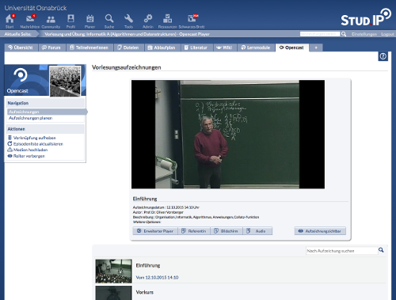

Stud.IP-Opencast-Plugin
=======================

*This plugin serves as a connection between [Opencast](http://opencast.org) and
the LMS [Stud.IP](http://studip.de/).*

Mit dem Opencast-Plugin kann eine Verbindung zwischen einer
Opencast-Installation und dem Lernmanagementsystem Stud.IP hergestellt werden.
Dies ermöglicht die Erstellung, Verwaltung und Veröffentlichung von
Vorlesungsaufzeichnungen direkt in Stud.IP.

Der Fokus der Entwicklung liegt bei einer möglichst intuitiven und einfachen
Bedienung. Somit ist für die Verwendung des Plugins kaum Vorwissen nötig.
Außerdem wurde sichergestellt, dass das Plugin folgende
Anforderungen erfüllt:

*Transparenz der Aufzeichnungstechnik:* Die DozentInnen können in ihren
Veranstaltung direkt erkennen, ob der gebuchte Veranstaltungsraum mit
entsprechender Aufzeichnungstechnik ausgerüstet ist. Dies wird im Plugin durch
die Verknüpfung von Stud.IP-Ressourcen mit Aufzeichnungsgeräten in Opencast
sichergestellt. DozentInnen benötigen dafür kein technisches Vorwissen über
die verwendete Aufzeichnungstechnik.

*Einfache Aufzeichnungsplanung:* Vorlesungsaufzeichnungen können direkt in dem
Stud.IP-Kurs von den DozentInnen geplant werden. Dabei werden im Kurs
verfügbare Metadaten bei der Planung berücksichtig. Möglich ist dies mit einer
eigenen Planungsansicht. Hiermit entfällt die mehrfache Eingabe von Metadaten.

*Kontrolle der Sichtbarkeit:* Die DozentInnen können die Sichtbarkeit jeder
Aufzeichnung in Stud.IP individuell festlegen.

> 

Features im Überblick
---------------------

- Verknüpfung von Räumen mit Aufzeichnungsgeräten
- Planung von Aufzeichnungen
- Verknüpfung von Kursen mit Aufzeichnungserien
- Upload von Medien zu Opencast

Literatur
---------

- Andre Klassen, Rudiger Rolf, Lars Kiesow, Denis Meyer, "Integrating
  Production and Distribution of Lecture Related Media into an LMS," ism,
  pp.457-460, 2012 IEEE International Symposium on Multimedia, 2012

Support/Kontakt
---------------

- Till Glöggler (ELAN e.V.), till.gloeggler@elan-ev.de
