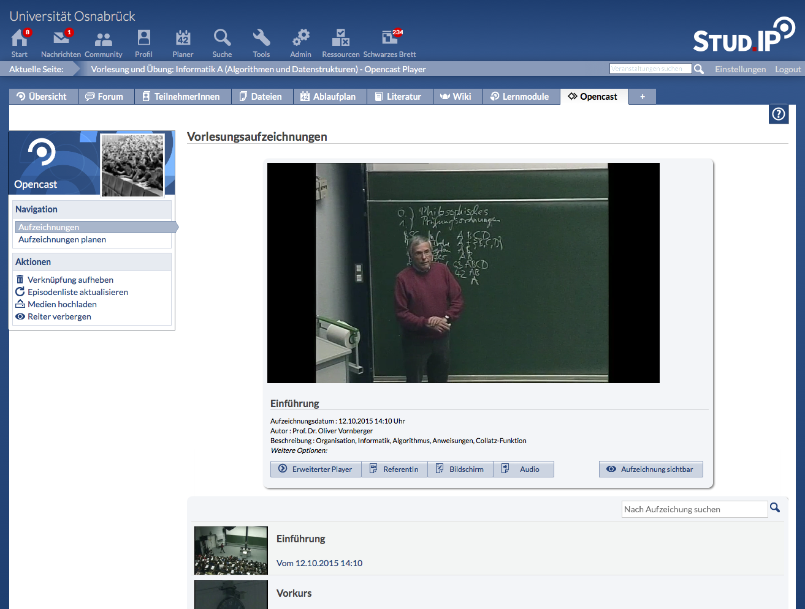

Stud.IP-Opencast-Plugin
=======================

*This plugin serves as a connection between [Opencast](http://opencast.org) and
the LMS [Stud.IP](http://studip.de/).*

Mit dem Opencast-Plugin kann eine Verbindung zwischen einer
Opencast-Installation und dem Lernmanagementsystem Stud.IP hergestellt werden.
Das Plugin bildet hierbei die Prozesse für das Management von Audio- und
Videoinhalten, vor allem für die Aufzeichnung und Distribution von
Lehrveranstaltungen im Lernmanagementsystem ab.

Der Fokus liegt bei einer intuitiven einfachen Bedienung. Somit ist für das
Verwenden und Verwalten von Videoinhalten kaum Vorwissen nötig.

Bei der Entwicklung des Plugins wurde sichergestellt, dass folgende typische
Anforderungen erfüllt sind:

*Transparenz der Aufzeichnungstechnik:* Die DozentInnen können in ihren
Veranstaltung direkt erkennen, ob der gebuchte Veranstaltungsraum mit
entsprechender Aufzeichnungstechnik ausgerüstet ist. Dies wird im Plugin durch
die Verknüpfung von Stud.IP-Ressourcen mit Aufzeichnungsgeräten in Opencast
sichergestellt.  DozentInnen benötigen hierbei kein technisches Vorwissen über
die verwendete Aufzeichnungstechnik.

*Einfache Aufzeichnungsplanung:* Vorlesungsaufzeichnungen sollen direkt aus dem
Kurs im LMS von der DozentIn geplant werden können. Im Kurs verfügbare
Metadaten sollen bei der Planung berücksichtigt werden. Umgesetzt wird dies mit
einer eigenen Planungsansicht im Plugin, basierend auf dem Ablaufplan.  Hiermit
entfällt die mehrfache Eingabe von kursbezogenen Metadaten.

*Kontrolle der Sichtbarkeit:* Die DozentInnen sollen die Sichtbarkeit jeder
Aufzeichnung in Stud.IP individuell festlegen können.  Dies ermöglicht ein
eigenes Einstellungsmenü in der Kursansicht.  Hier können die DozentInnen über
die Sichtbarkeit jeder einzelnen Aufzeichnung entscheiden.

> 

Features im Überblick
---------------------

- Globale Konfiguration
- Verknüpfung von Opencast-Capture-Agents
- Planen von Aufzeichnungen
- Verknüpfung von Aufzeichnungserien
- Upload von Medien zu Opencast

Literatur
---------

- Andre Klassen, Rudiger Rolf, Lars Kiesow, Denis Meyer, "Integrating
  Production and Distribution of Lecture Related Media into an LMS," ism,
  pp.457-460, 2012 IEEE International Symposium on Multimedia, 2012

Support/Kontakt
---------------

- Till Glöggler (ELAN e.V.), till.gloeggler@elan-ev.de
